# Intelligent Health Prediction System

> **Course:** Studio Projektowe 1  
> **Project Type:** University Project

An AI-powered health prediction system designed to assess health risks based on user-submitted medical questionnaires. The application leverages custom machine learning models and generative AI to provide personalized health recommendations and risk assessments.

---

## Authors (Group 1)

| Name              | Email                         |
| :---------------- | :---------------------------- |
| Patryk Chamera    | pchamera@student.agh.edu.pl   |
| Karol Bystrek     | karbystrek@student.agh.edu.pl |
| Mateusz Bielówka  | mbielowka@student.agh.edu.pl  |
| Berenike Banek    | berenike@student.agh.edu.pl  |
| Maksim Dziatkou   | mdziatkou@student.agh.edu.pl  |

---

## System Architecture & Overview

The Intelligent Health Prediction System is a containerized, distributed application composed of three main microservices:

### Architecture Components

1. **Frontend** — A modern React-based user interface built with TypeScript and Material-UI, providing an intuitive experience for users to interact with health prediction services.

2. **Backend** — A Spring Boot REST API that serves as the core application logic layer, handling user authentication, authorization, data persistence, and orchestration of AI services.

3. **Python Prediction Service** — A dedicated FastAPI microservice responsible for machine learning model inference. This service loads pre-trained models and performs health risk predictions based on user-submitted questionnaire data.

### Authentication & Security

The system implements **JWT (JSON Web Token)**-based authentication and authorization. Users authenticate through secure login endpoints, and all protected API routes require valid JWT tokens. The backend enforces role-based access control (RBAC), supporting both regular users and administrators.

### Communication Flow

- The frontend communicates with the backend API over HTTP/REST
- The backend orchestrates requests to the Python prediction service via internal network calls
- All services communicate within a Docker Compose network, ensuring secure and efficient inter-service communication
- PostgreSQL serves as the primary database for user data, demographics, and prediction history

---

## AI & Machine Learning Models

The system implements three distinct machine learning models, each trained to predict specific health risks:

### 1. Diabetes Prediction Model
- **Algorithm:** Random Forest Classifier
- **Purpose:** Predicts the risk of diabetes based on key health indicators including HbA1c level, blood glucose level, BMI, age, and smoking history
- **Documentation:** [Diabetes Model Documentation](./health-prediction-service/documentation/diabetes-random-forest-docu.md)

### 2. Heart Attack Prediction Model
- **Algorithm:** AdaBoost Classifier
- **Purpose:** Assesses the risk of heart attack using clinical parameters such as age, sex, chest pain type, blood pressure, cholesterol levels, and exercise-related metrics
- **Documentation:** [Heart Attack Model Documentation](./health-prediction-service/documentation/heart_attack-ada_boost-docu.md)

### 3. Stroke Prediction Model
- **Algorithm:** Support Vector Machine (SVM)
- **Purpose:** Evaluates stroke risk based on demographic and medical factors including age, sex, hypertension, heart disease, work type, average glucose level, and BMI
- **Documentation:** [Stroke Model Documentation](./health-prediction-service/documentation/stroke-svm-docu.md)

### Model Documentation

Comprehensive technical documentation for each model is available in the [`health-prediction-service/documentation`](./health-prediction-service/documentation/) directory. These documents include:

- Training data sources and dataset descriptions
- Data preprocessing and feature engineering approaches
- Model training methodology and hyperparameter tuning
- Performance metrics (accuracy, precision, recall, F1-score, ROC curves)
- Feature importance analysis
- Confusion matrices and evaluation visualizations

---

## Key Features & User Guide

### Authentication Pages

#### Login Page
Users can securely log in to their accounts using their credentials. The system validates credentials and issues a JWT token for subsequent authenticated requests.

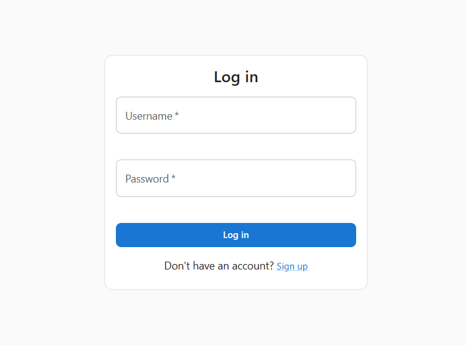

#### Signup Page
New users can create an account by providing their personal information, including username, email, password, first name, and last name.

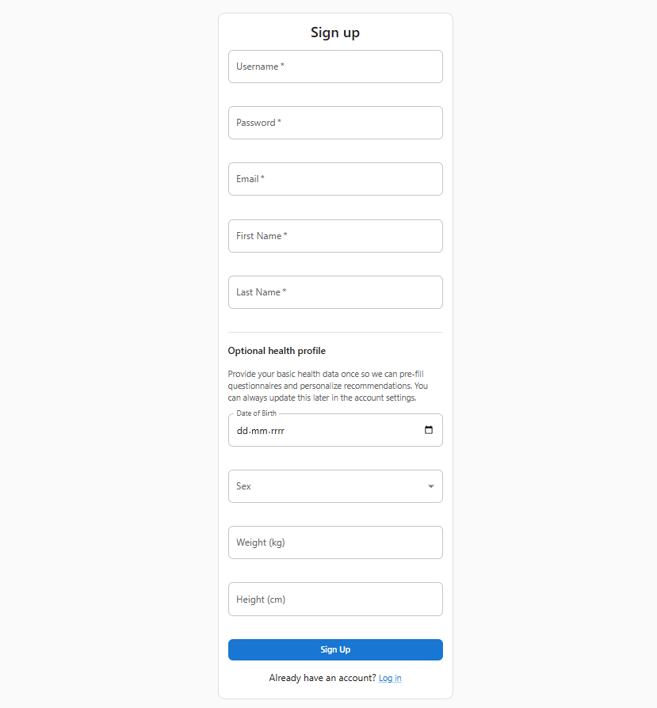

### Main Application Pages

#### Home Dashboard
The home page provides a comprehensive health dashboard displaying:
- Personalized welcome message with user information
- Recent prediction results and risk assessments
- Health trend visualizations and charts
- Quick access to health questionnaires
- Summary statistics of user's health data

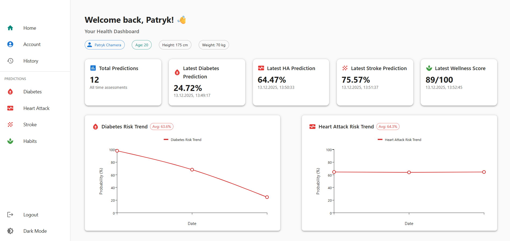
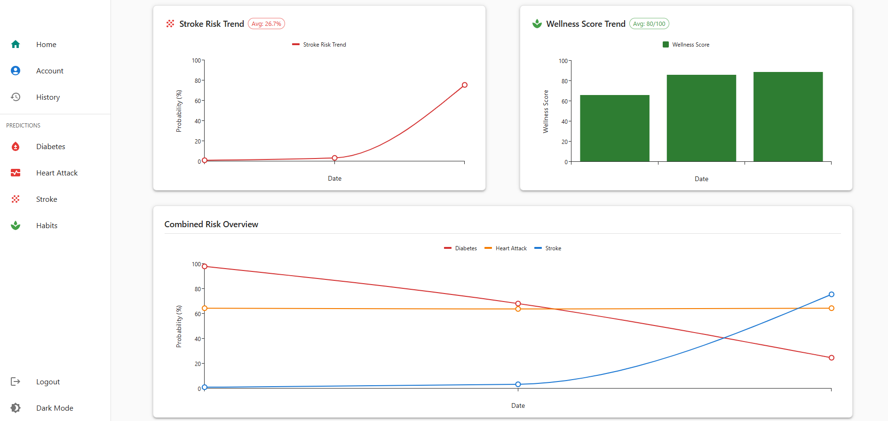

#### Health Questionnaires
Users can complete specialized questionnaires for different health risk assessments. Each questionnaire collects relevant health data and submits it to the appropriate machine learning model for risk prediction. After submission, the system processes the data and displays comprehensive prediction results with AI-generated recommendations.

##### Diabetes Questionnaire

The Diabetes Questionnaire collects essential health indicators for diabetes risk assessment:
- **HbA1c level** — Average blood sugar levels over the past 2-3 months
- **Blood glucose level** — Current blood glucose measurement
- **BMI (Body Mass Index)** — Calculated from height and weight
- **Age** — User's current age
- **Smoking history** — Categorization of smoking habits

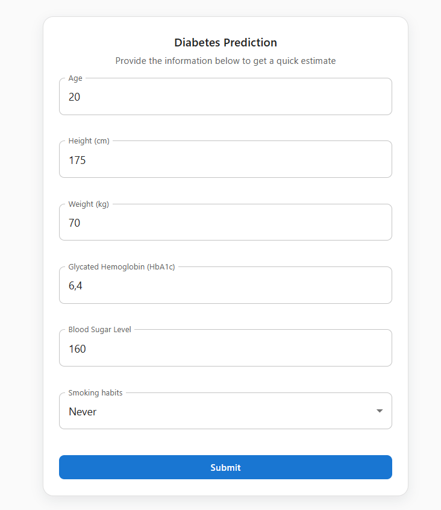

**Diabetes Prediction Results**

After submitting the diabetes questionnaire, the system displays a comprehensive prediction result page that includes:

- **Prediction Probability** — A percentage value indicating the calculated diabetes risk probability
- **Input Data Summary** — A detailed breakdown of all parameters used in the prediction (HbA1c level, blood glucose, BMI, age, smoking history)
- **AI-Generated Recommendations** — Personalized health advice generated by Google's Gemini AI model

The LLM analyzes the prediction results and user input data to provide contextual health insights, including detailed explanations of critical lab values (such as HbA1c levels and their significance in relation to pre-diabetes and diabetes thresholds), personalized recommendations for lifestyle improvements, and guidance on when to consult healthcare professionals. The recommendations are educational, supportive, and non-diagnostic, focusing on preventive measures and lifestyle improvements.

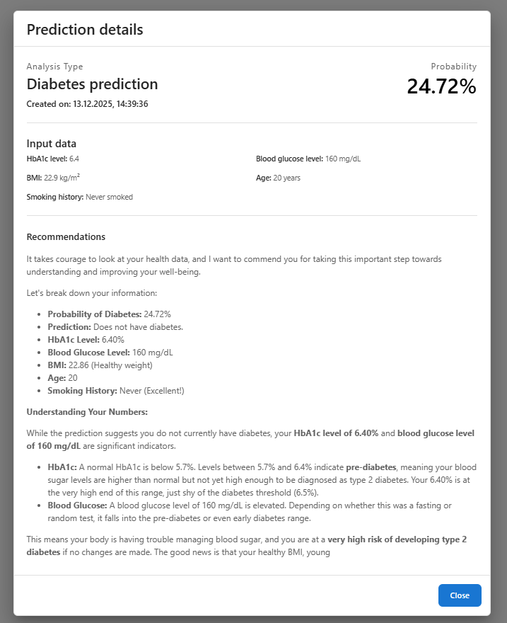

##### Heart Attack Questionnaire

The Heart Attack Questionnaire gathers clinical parameters related to cardiovascular health:
- **Age and Sex** — Demographic information
- **Chest pain type (CP)** — Classification of chest pain symptoms
- **Resting blood pressure (trestbps)** — Blood pressure at rest
- **Cholesterol level (chol)** — Serum cholesterol measurement
- **Maximum heart rate achieved (thalach)** — Peak heart rate during exercise
- **ST depression (oldpeak)** — Electrocardiogram measurement
- **Exercise-induced angina (exang)** — Presence of chest pain during exercise

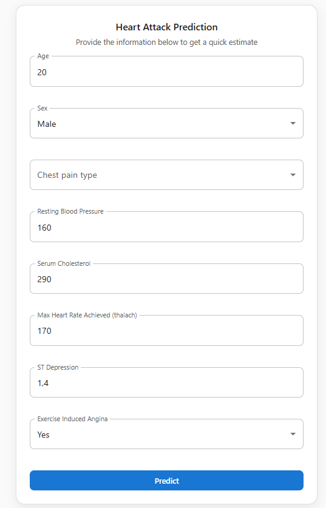

**Heart Attack Prediction Results**

The heart attack prediction results page presents:

- **Prediction Probability** — A percentage value indicating the calculated heart attack risk probability
- **Input Data Summary** — Complete breakdown of all clinical parameters used in the prediction
- **AI-Generated Recommendations** — Personalized cardiovascular health advice from the Gemini AI model

The LLM provides detailed explanations of cardiovascular risk factors, interprets the clinical significance of blood pressure and cholesterol levels, offers evidence-based lifestyle recommendations for heart health, and advises on when to seek medical consultation for cardiovascular concerns.

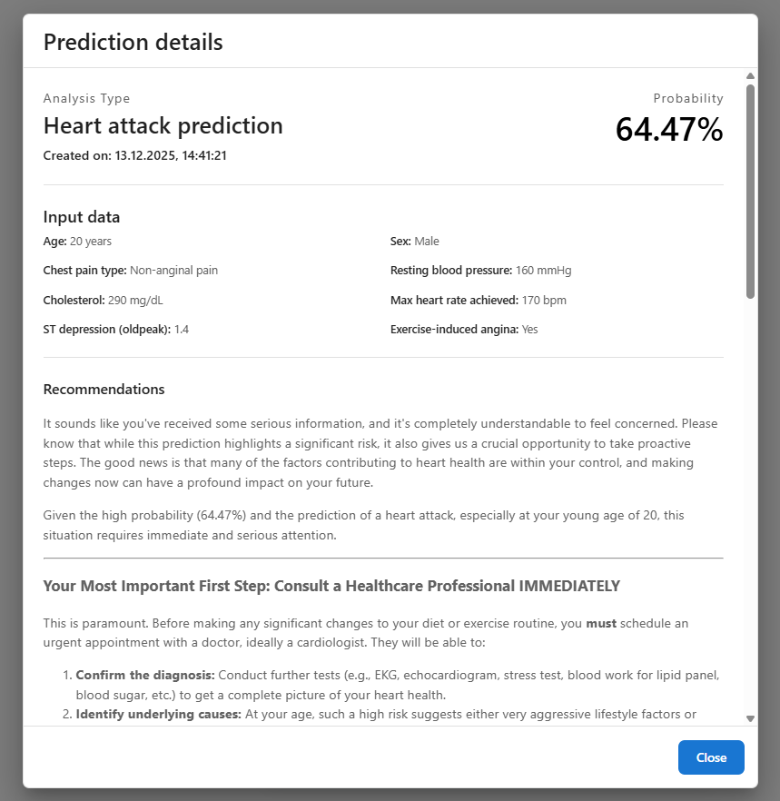

##### Stroke Questionnaire

The Stroke Questionnaire captures factors associated with stroke risk:
- **Age and Sex** — Demographic information
- **Hypertension** — History of high blood pressure
- **Heart disease** — Presence of cardiovascular conditions
- **Work type** — Occupational classification
- **Average glucose level** — Blood glucose measurement
- **BMI** — Calculated from height and weight

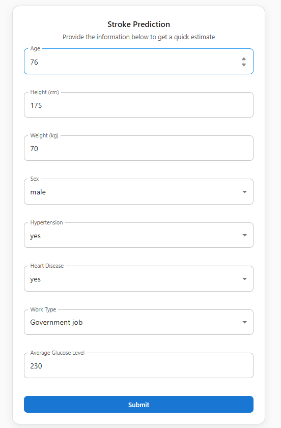

**Stroke Prediction Results**

The stroke prediction results page includes:

- **Prediction Probability** — A percentage value indicating the calculated stroke risk probability
- **Input Data Summary** — Detailed breakdown of all risk factors used in the prediction
- **AI-Generated Recommendations** — Personalized stroke prevention advice from the Gemini AI model

The LLM analyzes stroke risk factors, explains the relationship between hypertension, heart disease, and stroke risk, provides actionable recommendations for reducing stroke risk through lifestyle modifications, and emphasizes the importance of managing underlying conditions like hypertension and diabetes.

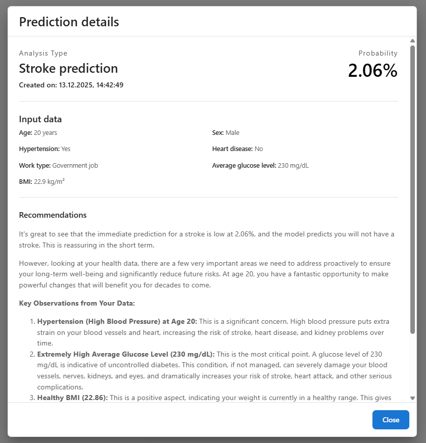

##### Habits Assessment

The Habits Assessment evaluates lifestyle factors and provides comprehensive wellness recommendations:
- **Physical activity levels** — Exercise frequency and intensity
- **Dietary patterns** — Eating habits and nutrition
- **Sleep quality** — Sleep duration and quality metrics
- **Stress management** — Stress levels and coping mechanisms
- **Other lifestyle factors** — Additional wellness indicators

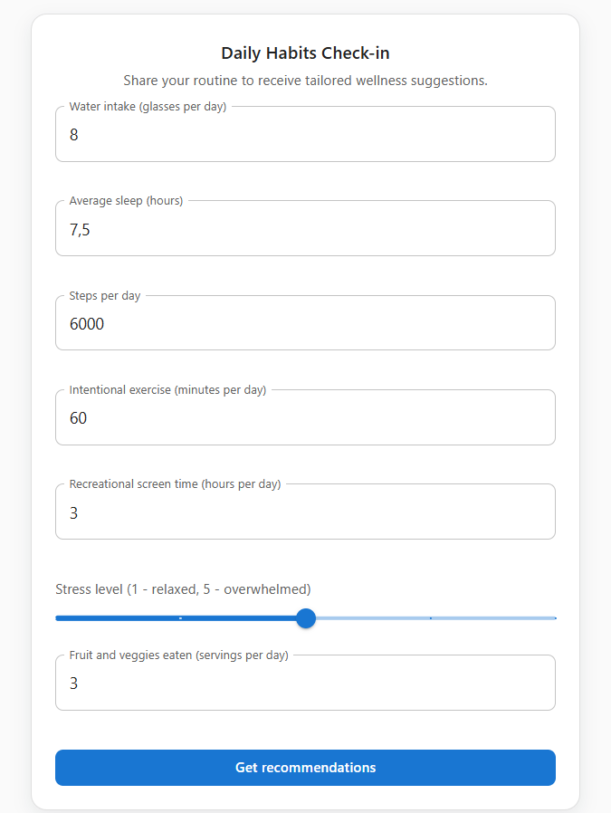

**Habits Assessment Results**

The habits assessment results page provides:

- **Wellness Score** — A comprehensive evaluation of overall lifestyle health
- **Input Data Summary** — Summary of all lifestyle factors assessed
- **AI-Generated Recommendations** — Holistic wellness advice from the Gemini AI model

The LLM offers comprehensive lifestyle guidance, including personalized recommendations for improving physical activity, optimizing dietary habits, enhancing sleep quality, managing stress effectively, and creating a balanced wellness plan. The recommendations focus on sustainable lifestyle changes that promote long-term health and well-being.

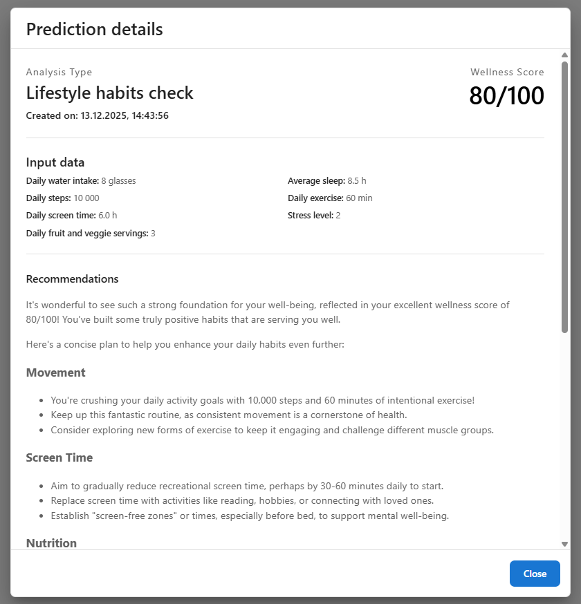

#### Prediction History
Users can view their complete history of health predictions, including:
- Timestamp of each prediction
- Prediction type (diabetes, heart attack, stroke, habits)
- Risk probability scores
- AI-generated recommendations
- Historical trend analysis

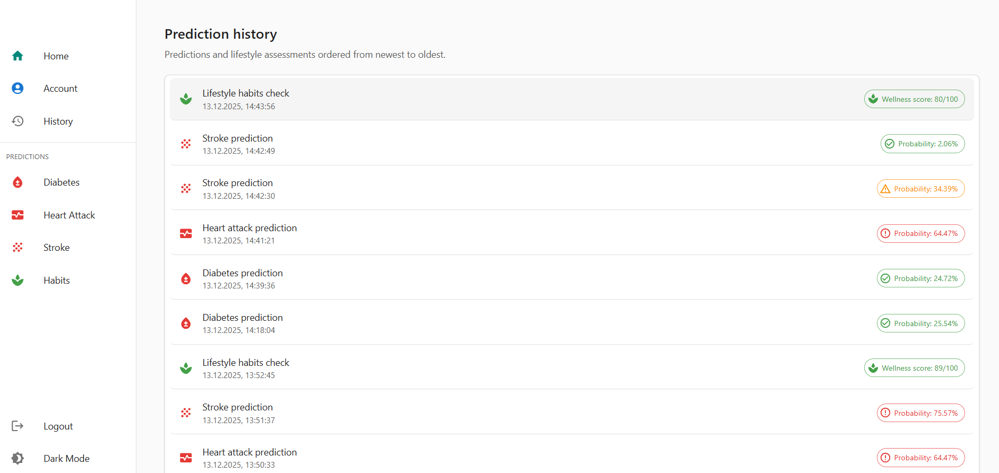

#### Account Settings
The account page allows users to:
- Update personal profile information (name, email, username)
- Manage demographic data (date of birth, height, weight)
- Delete their account

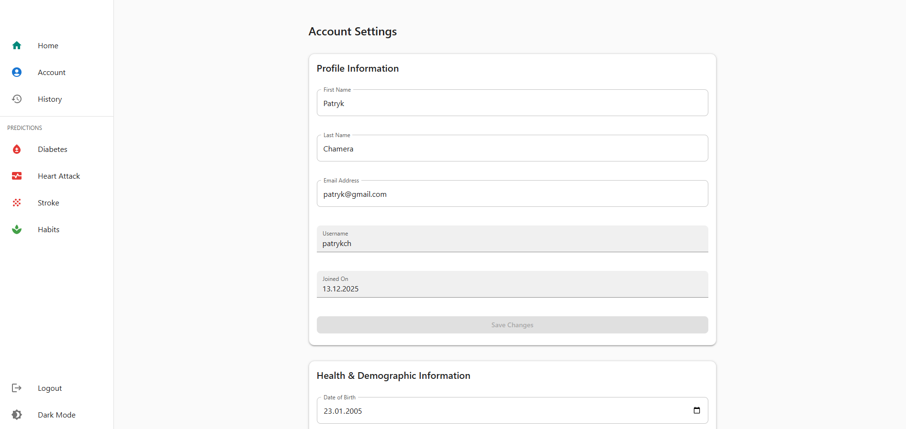


### Admin Panel

**[Work In Progress / TODO]**

The Admin Panel module is currently under development. Planned features include:
- User management and administration
- ... TODO

---

## Technology Stack

### Frontend
- **React 19** — Modern UI library
- **TypeScript** — Type-safe JavaScript
- **Vite** — Build tool and development server
- **Material-UI (MUI)** — Component library and design system
- **React Router** — Client-side routing
- **TanStack Query** — Data fetching and caching
- **Axios** — HTTP client

### Backend
- **Java 21** — Programming language
- **Spring Boot 3.5.6** — Application framework
- **Spring Security** — Authentication and authorization
- **Spring Data JPA** — Data persistence
- **PostgreSQL** — Relational database
- **Flyway** — Database migration management
- **JWT** — JSON Web Token authentication
- **OpenFeign** — HTTP client for microservices communication
- **Lombok** — Boilerplate reduction

### Python Prediction Service
- **Python 3** — Programming language
- **FastAPI** — Modern web framework
- **scikit-learn** — Machine learning library
- **pandas** — Data manipulation
- **numpy** — Numerical computing
- **joblib** — Model serialization
- **imbalanced-learn** — Handling class imbalance

### Infrastructure & DevOps
- **Docker** — Containerization
- **Docker Compose** — Multi-container orchestration
- **PostgreSQL** — Database service

### AI & Machine Learning
- **Google Gemini API** — Generative AI for health recommendations
- **Custom ML Models** — Pre-trained models (Random Forest, AdaBoost, SVM)

---

## Installation & Setup

### Prerequisites

- **Docker Desktop** installed and running
- **Git** for cloning the repository

### Quick Start with Docker

The application is fully containerized and can be run using Docker Compose.

1. **Clone the repository:**
   ```bash
   git clone <repository-url>
   cd Intelligent-Health-Prediction-System
   ```

2. **Configure environment variables:**
   
   Create a `.env` file in the `backend/` directory based on the `.env.example` template:
   ```bash
   cp backend/.env.example backend/.env
   ```
   
   **CRITICAL:** Edit `backend/.env` and update the following required variables:
   - `JWT_SECRET` — A secure random string used for signing JWT tokens (minimum 64 characters recommended)
   - `GEMINI_API_KEY` — Your Google AI Studio API key (obtain from [Google AI Studio](https://aistudio.google.com/app/apikey))
   
   Optional Gemini configuration variables (with defaults):
   - `GEMINI_API_VERSION` — API version (default: `v1beta`)
   - `GEMINI_MODEL` — Model name (default: `gemini-2.5-flash`)
   - `GEMINI_TEMPERATURE` — Randomness control (default: `0.3`)
   - `GEMINI_TOP_P` — Nucleus sampling (default: `0.90`)
   - `GEMINI_MAX_OUTPUT_TOKENS` — Maximum response length (default: `2048`)
   - `GEMINI_TIMEOUT_MS` — Request timeout (default: `30000`)

3. **Start all services:**
   ```bash
   docker-compose up --build
   ```
   
   This command will:
   - Build Docker images for all services
   - Start PostgreSQL database
   - Start Python prediction service
   - Start Spring Boot backend
   - Start React frontend

4. **Access the application:**
   - **Frontend:** http://localhost:5173
   - **Backend API:** http://localhost:8080
   - **Python Service:** http://localhost:5000 (internal network)

### Stopping the Application

To stop all containers:
```bash
docker-compose down
```

To stop and remove volumes (deletes database data):
```bash
docker-compose down -v
```

### Service-Specific Documentation

For detailed setup instructions and configuration options for individual services, refer to:
- [Backend README](./backend/README.md) — Database setup, Flyway migrations, environment variables
- [Frontend README](./frontend/README.md) — Development server, build commands
- [Python Service README](./health-prediction-service/README.md) — Model loading, API endpoints

---

## Development Process

### Microservices Architecture

The system follows a microservices architecture pattern, where each service operates independently:

- **Service Isolation:** Each service (frontend, backend, Python service) runs in its own container with isolated dependencies
- **API Gateway Pattern:** The Spring Boot backend acts as an API gateway, handling authentication and routing requests to appropriate services
- **Service Communication:** Services communicate via HTTP/REST APIs over Docker's internal network
- **Database Per Service:** The backend maintains its own PostgreSQL database, while the Python service is stateless and loads models from the filesystem

### Containerization Strategy

- **Multi-stage Builds:** Dockerfiles optimize image sizes by separating build and runtime dependencies
- **Volume Mounting:** Development mode uses volume mounts for hot-reloading (frontend source code)
- **Environment Configuration:** Environment variables are externalized for easy configuration across environments
- **Dependency Management:** Services declare dependencies explicitly (Maven for Java, npm for Node.js, pip for Python)

### Development Workflow

1. **Local Development:** Developers can run services individually using their respective build tools (Maven, npm, Python)
2. **Integration Testing:** Docker Compose ensures all services work together correctly
3. **Database Migrations:** Flyway manages schema changes automatically on application startup
4. **Model Deployment:** ML models are packaged in the Python service container and loaded at runtime

---

## Additional Resources

### Module Documentation

- **Backend README:** [backend/README.md](backend/README.md) — Spring Boot API setup, database configuration, Flyway migrations, environment variables, API endpoints, and Swagger documentation
- **Frontend README:** [frontend/README.md](frontend/README.md) — React application setup, development scripts, environment configuration, component structure, and state management
- **Health Prediction Service README:** [health-prediction-service/README.md](health-prediction-service/README.md) — FastAPI service setup, ML model information, API endpoints, model loading, and configuration

### Additional Documentation

- **Testing Documentation:** [TESTING.md](TESTING.md) — Test setup, running tests, test coverage, and testing best practices
- **Model Documentation:** [health-prediction-service/documentation](./health-prediction-service/documentation/) — Detailed technical documentation for each ML model including training methodology, performance metrics, and feature analysis

---

## License

See [LICENSE](LICENSE) file for details.
